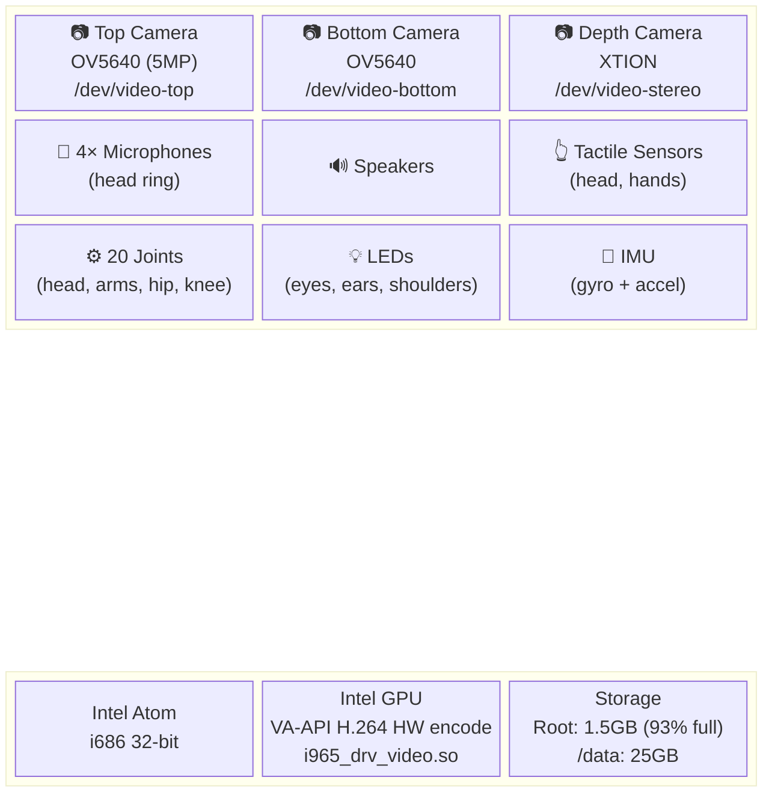
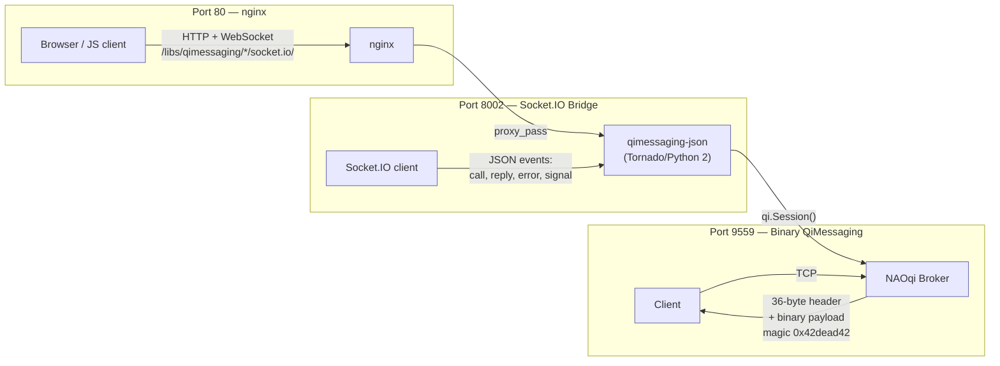
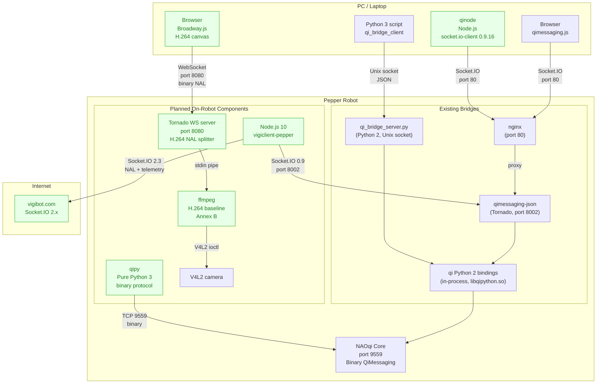
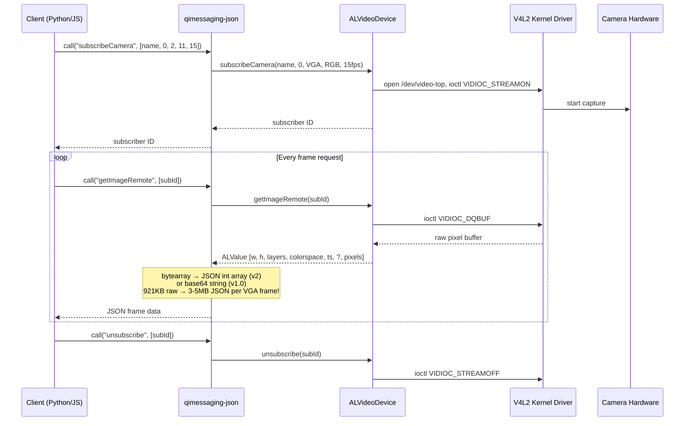
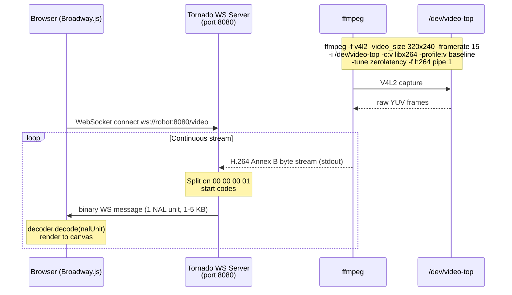
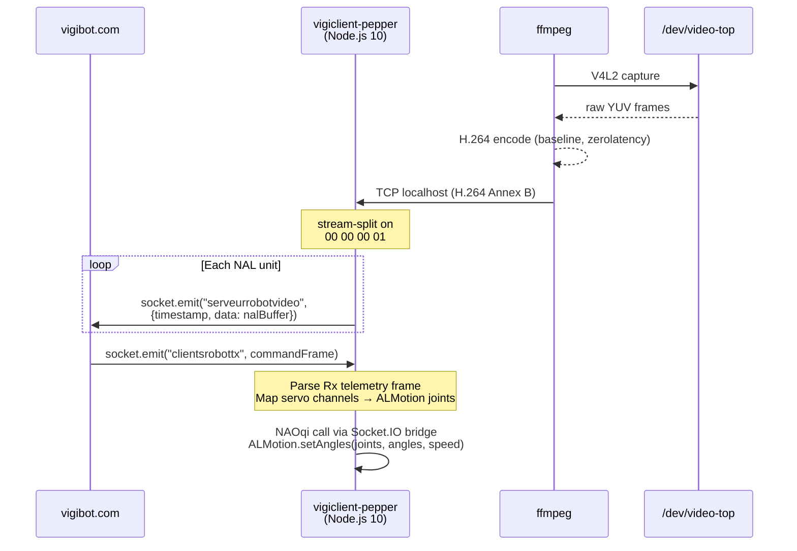
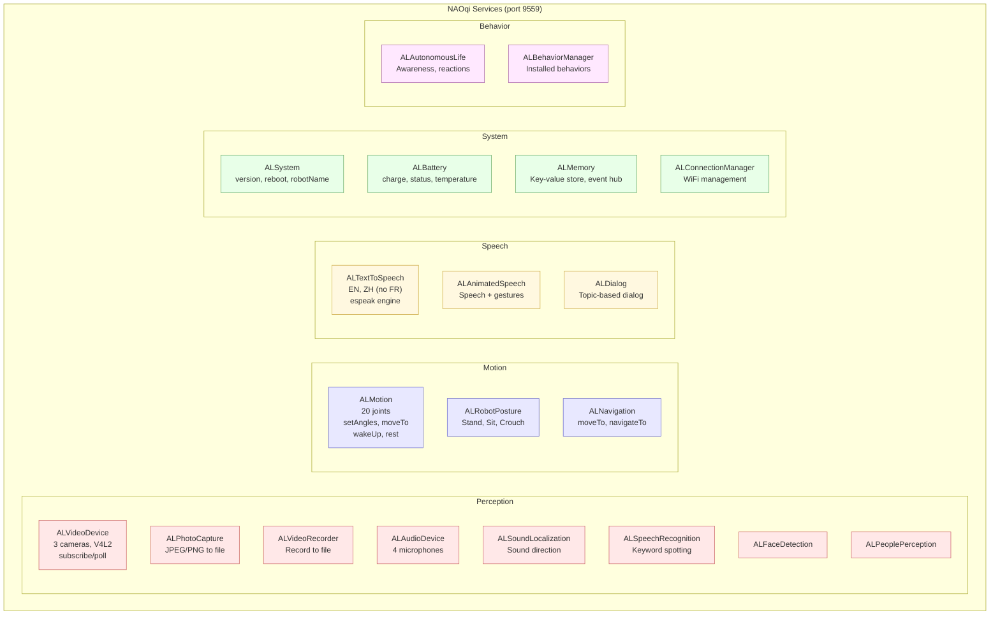
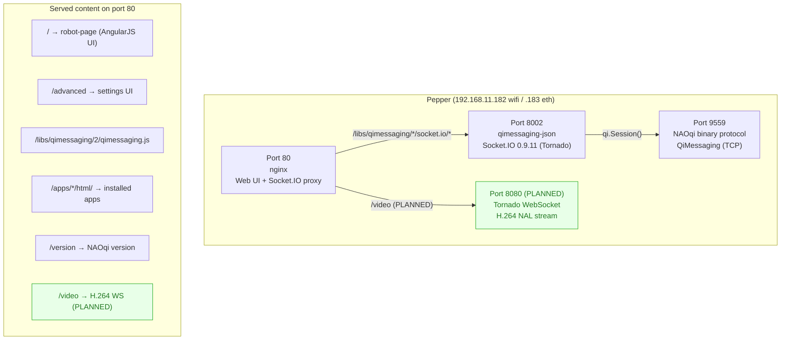
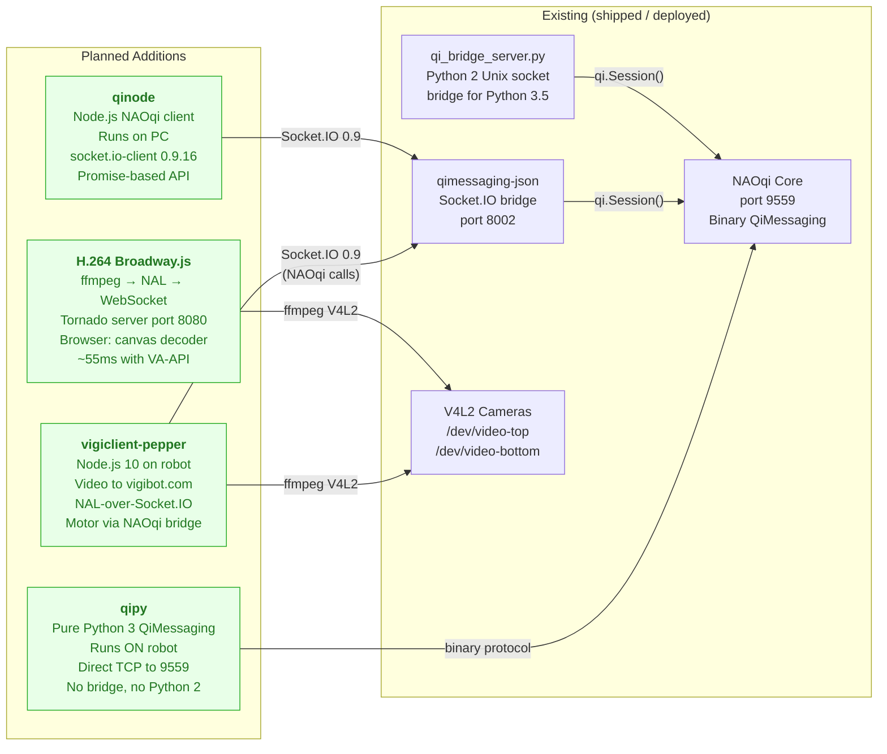

# Pepper Robot — System Architecture

## Overview

This document describes the internal software architecture of the Pepper robot (NAOqiOS 3.3.10.1, NAOqi 2.7.1.128) and planned additions for Python 3 and Node.js bindings.

**Color convention in diagrams:**
- Default / neutral colors = existing base architecture (shipped with the robot)
- <span style="color:#22aa22">**Green**</span> = planned additions (qipy, qinode, vigiclient, Broadway.js streaming)

---

## 1. Hardware Layer



---

## 2. Full Software Stack

```mermaid
flowchart TB
  subgraph ROBOT["<b>Pepper Robot</b> (NAOqiOS 3.3.10.1, i686)"]
    direction TB

    subgraph KERNEL["Kernel (4.0.4-rt1-aldebaran, PREEMPT RT)"]
      V4L2["V4L2 drivers\n(videodev, uvcvideo, soc_camera)"]
      GPIO["I2C / GPIO / UART"]
      ALSA_K["ALSA audio"]
    end

    subgraph NAOQI["NAOqi Core (port 9559)"]
      NAOQI_BIN["naoqi-bin\nService broker\nBinary QiMessaging\nmagic 0x42dead42"]
      ALVIDEO["ALVideoDevice"]
      ALMOTION["ALMotion\n(20 joints)"]
      ALTTS["ALTextToSpeech"]
      ALAUDIO["ALAudioDevice"]
      ALMEM["ALMemory"]
      ALSYS["ALSystem"]
      ALLIFE["ALAutonomousLife"]
      ALBAT["ALBattery"]
      ALPHOTO["ALPhotoCapture"]
    end

    subgraph PY2ENV["Python 2.7 Environment"]
      QI_PY2["qi Python 2 bindings\n(libqipython.so + _qi.so)"]
      PYTHON2["Python 2.7.11\n(/usr/bin/python2)"]
    end

    subgraph WEBBRIDGE["Web / Socket.IO Bridge"]
      QIMSG_JSON["qimessaging-json\n(Python 2 / Tornado 4.3)\nSocket.IO 0.9.11, port 8002"]
      NGINX["nginx 1.8.1\nport 80\nproxy → 127.0.0.1:8002"]
      QIMSG_JS["qimessaging.js v1.0 + v2\n(/opt/aldebaran/var/www/)"]
    end

    subgraph MEDIA["Media Tools (installed)"]
      FFMPEG["ffmpeg 3.0\nlibx264, libavcodec57\nVA-API support"]
      GST["GStreamer 0.10 + 1.0\njpegenc, x264enc, vaapi"]
      LIBJPEG["libjpeg 6.2"]
    end

    subgraph PY3ENV["Python 3.5 (/data/python3.5/) — deployed"]
      PYTHON3["Python 3.5.10"]
      QI_BRIDGE["qi_bridge_server.py\n(Python 2 process)\nUnix socket JSON"]
      QI_CLIENT["qi_bridge_client.py\n(Python 3 module)"]
      PY3QI["python3-qi wrapper"]
    end

    subgraph QIPY["qipy — Pure Python 3 QiMessaging (PLANNED)"]
      QIPY_LIB["qipy library\nDirect TCP to port 9559\nNo C extensions, no bridge"]:::planned
    end

    subgraph VIGICLIENT["vigiclient-pepper (PLANNED)"]
      NODE10["Node.js 10\n(/data/node10/)"]:::planned
      VIGICLI["vigiclient (modified)\nsocket.io-client 2.3\nstream-split NAL"]:::planned
    end

    subgraph H264STREAM["H.264 Video Streaming (PLANNED)"]
      WS_SERVER["Tornado WebSocket server\nport 8080\nNAL splitter"]:::planned
    end

    %% Existing connections
    V4L2 -.->|"V4L2 ioctl"| ALVIDEO
    GPIO -.-> ALMOTION
    ALSA_K -.-> ALAUDIO

    ALVIDEO & ALMOTION & ALTTS & ALAUDIO & ALMEM & ALSYS & ALLIFE & ALBAT & ALPHOTO --> NAOQI_BIN

    QI_PY2 -->|"binary protocol\n(in-process)"| NAOQI_BIN
    PYTHON2 --> QI_PY2

    QIMSG_JSON -->|"import qi\nqi.Session()"| QI_PY2
    NGINX -->|"proxy\nSocket.IO"| QIMSG_JSON

    QI_BRIDGE -->|"import qi"| QI_PY2
    QI_CLIENT -.->|"Unix socket\nJSON"| QI_BRIDGE
    PY3QI --> QI_BRIDGE & PYTHON3

    %% Planned connections
    QIPY_LIB -->|"TCP 9559\nbinary QiMessaging"| NAOQI_BIN
    VIGICLI -->|"Socket.IO 0.9\nNAOqi calls"| QIMSG_JSON
    WS_SERVER -->|"stdin pipe\nH.264 Annex B"| FFMPEG
    FFMPEG -->|"V4L2 capture"| V4L2
  end

  subgraph PC["<b>PC / Laptop</b> (LAN)"]
    subgraph QINODE["qinode — Node.js NAOqi client (PLANNED)"]
      QINODE_LIB["qinode library\nsocket.io-client 0.9.16\nServiceProxy + MetaObject"]:::planned
    end

    subgraph BROWSER_G["Browser"]
      BROWSER_SDK["qimessaging.js\n(official SDK)\nSocket.IO 0.9.11"]
      BROADWAY["Broadway.js (PLANNED)\nH.264 decoder → canvas\nWebSocket client"]:::planned
    end
  end

  subgraph CLOUD["<b>vigibot.com</b> (Internet)"]
    VIGIBOT_SRV["Vigibot server\nSocket.IO 2.x\nRobot control + video relay"]:::planned
  end

  %% External connections (existing)
  BROWSER_SDK -->|"Socket.IO\nport 80"| NGINX

  %% External connections (planned)
  QINODE_LIB -->|"Socket.IO 0.9\nport 80"| NGINX
  BROADWAY -->|"WebSocket port 8080\nbinary NAL units"| WS_SERVER
  VIGICLI -->|"Socket.IO 2.3\nNAL video + telemetry"| VIGIBOT_SRV

  classDef planned fill:#e8ffe8,stroke:#22aa22,color:#227722
```



---

## 3. Communication Protocols

### 3.1 Existing protocol layers



### 3.2 All protocol paths (existing + planned)



---

## 4. Video Pipeline

### 4.1 Existing video access (no streaming)



### 4.2 Planned H.264 streaming (Broadway.js)



### 4.3 Planned vigiclient video path



---

## 5. NAOqi Service Map



---

## 6. Network Ports & Endpoints



---

## 7. Filesystem Layout

```
/ (rootfs, 1.5 GB, 93% full — DO NOT install here)
├── opt/aldebaran/
│   ├── bin/
│   │   └── qimessaging-json          # Socket.IO ↔ NAOqi bridge (Python 2)
│   ├── lib/
│   │   ├── naoqi/
│   │   │   ├── libalvideodevice.so    # ALVideoDevice
│   │   │   ├── libphotocapture.so     # ALPhotoCapture
│   │   │   └── libvideorecorder.so    # ALVideoRecorder
│   │   ├── libvideodevice.so          # V4L2 hardware layer
│   │   ├── libqipython.so            # Python 2 qi bindings
│   │   ├── libqipython3.so           # Python 3 qi bindings (UNUSABLE — ABI mismatch)
│   │   ├── libboost_python3.so.1.59.0
│   │   ├── libx264.so.144            # H.264 encoder
│   │   └── python2.7/site-packages/
│   │       ├── qi/                    # Python 2 SDK
│   │       └── vision_definitions.py  # Camera constants
│   └── var/www/
│       └── libs/qimessaging/
│           ├── 1.0/qimessaging.js     # Legacy JS SDK
│           └── 2/qimessaging.js       # Current JS SDK (Socket.IO 0.9.11 bundled)
├── usr/
│   ├── bin/
│   │   ├── ffmpeg                     # FFmpeg 3.0
│   │   ├── gst-launch-0.10           # GStreamer 0.10
│   │   └── gst-launch-1.0            # GStreamer 1.0
│   └── lib/
│       ├── libavcodec.so.57
│       ├── libjpeg.so.62
│       ├── libva.so.1                 # VA-API
│       ├── dri/i965_drv_video.so      # Intel GPU VA-API driver
│       ├── gstreamer-0.10/
│       │   ├── libgstjpeg.so          # JPEG encoder
│       │   ├── libgstx264.so          # H.264 encoder (annexb support)
│       │   ├── libgstmultipart.so     # Multipart mux (MJPEG)
│       │   └── libgsttcp.so           # TCP sink/source
│       └── gstreamer-1.0/
│           ├── libgstvideo4linux2.so  # V4L2 source
│           ├── libgstvaapi.so         # VA-API H.264/JPEG/VP8 HW encode
│           ├── libgstmultipart.so
│           └── libgsttcp.so
└── etc/nginx/nginx.conf               # nginx config (port 80)

/data/ (25 GB, plenty of space — install everything here)
├── python3.5/                          # DEPLOYED
│   ├── bin/
│   │   ├── python3.5                  # Python 3.5.10 interpreter
│   │   ├── python3-qi                 # Wrapper (starts bridge, sets env)
│   │   ├── qi_bridge_server.py        # Python 2 NAOqi proxy
│   │   ├── start_qi_bridge.sh         # Bridge lifecycle
│   │   └── pip3.5                     # Package manager
│   └── lib/
│       ├── libpython3.5m.so.1.0
│       └── python3.5/site-packages/
│           └── qi_bridge_client.py    # Python 3 client module
│
├── node10/                             # PLANNED (vigiclient)
│   ├── bin/
│   │   ├── node                       # Node.js 10.24.1
│   │   └── npm
│   └── lib/node_modules/
│
└── vigiclient-pepper/                  # PLANNED
    ├── clientrobotpi.js               # Modified vigiclient
    └── node_modules/
        ├── socket.io-client/          # 2.3.x
        └── stream-split/             # NAL splitter
```

<span style="color:#22aa22">Green items above are planned additions — everything else is already deployed.</span>

---

## 8. Planned Additions Summary



### Dependency matrix

| Component | Runs on | Connects to | Protocol | Status |
|-----------|---------|-------------|----------|--------|
| qi Python 2 | Robot | NAOqi | In-process (libqipython.so) | ✅ Shipped |
| qimessaging-json | Robot | NAOqi via qi Python 2 | Socket.IO 0.9 ↔ binary | ✅ Shipped |
| qi_bridge_server.py | Robot | NAOqi via qi Python 2 | Unix socket JSON ↔ binary | ✅ Deployed |
| qimessaging.js | Browser | nginx → qimessaging-json | Socket.IO 0.9 (JSON) | ✅ Shipped |
| **qipy** | Robot | NAOqi | TCP 9559 binary (pure Python 3) | 🟢 Planned |
| **qinode** | PC | nginx → qimessaging-json | Socket.IO 0.9 (JSON) | 🟢 Planned |
| **Broadway.js stream** | Robot + Browser | V4L2 → ffmpeg → WS → browser | H.264 NAL over WebSocket | 🟢 Planned |
| **vigiclient-pepper** | Robot | V4L2 + qimessaging-json + vigibot.com | H.264 NAL + telemetry over Socket.IO 2.3 | 🟢 Planned |
